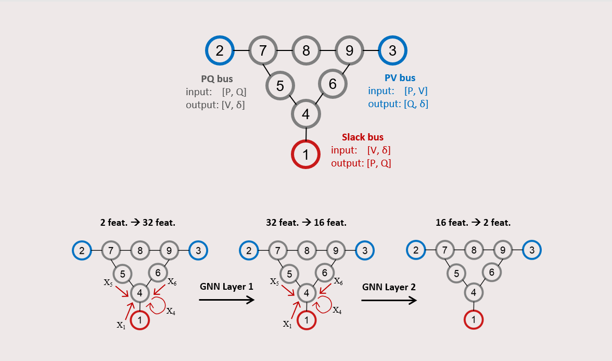

Here is your complete `README.md` file, ready to copy-paste into your new GitHub repository for the **GNN Power Grid Simulation** project:

---

### ✅ `README.md`

````markdown
# GNN-Based Power Grid Simulation

This repository explores the application of Graph Neural Networks (GNNs) for modeling and simulating electrical power grids. Each node (bus) in the network is treated as a vertex with associated features, and the GNN learns to predict electrical quantities like voltage and phase angle based on power input.

<p align="center">
  
</p>

## 📘 Project Overview

- **Slack Bus (Red)**: Input – Voltage (V), Angle (δ); Output – Active/Reactive Power (P, Q)
- **PQ Buses (Blue)**: Input – P, Q; Output – V, δ
- **PV Buses (Blue)**: Input – P, V; Output – Q, δ

The GNN learns to propagate and transform node-level features over graph layers:
- **Layer 1**: 2 features → 32 features
- **Layer 2**: 32 features → 16 features
- **Layer 3**: 16 features → 2 output features

## 📂 Repository Contents

- `gnn-framework.ipynb`: GNN model built using frameworks like PyTorch Geometric
- `gnn-fromscratch.ipynb`: Raw GNN implementation using only PyTorch
- `gnn_dataset.xlsx`: Sample dataset representing the power grid nodes
- `gnn.PNG`: Architecture diagram showing node types and feature transformation

## 🛠 Requirements

Install required libraries:

```bash
pip install torch numpy pandas matplotlib openpyxl
# If using PyTorch Geometric version
pip install torch-geometric
````

## 🚀 Running the Code

1. Clone or download this repository.
2. Open the notebook (`gnn-framework.ipynb` or `gnn-fromscratch.ipynb`) using Jupyter or VS Code.
3. Make sure the dataset `gnn_dataset.xlsx` is in the same directory.
4. Run the cells to train and evaluate the GNN on the power grid.

## 📈 Objective

The goal is to:

* Simulate and predict voltage and phase angle based on power input
* Demonstrate how GNNs model relationships across grid nodes
* Visualize how node features evolve across layers

## 🧪 Educational Value

This project helps you understand:

* Message passing in GNNs
* Feature propagation in electrical networks
* GNN architectures for structured data

## 📄 License

This project is licensed under the MIT License. You're free to use, modify, and share it for educational and research purposes.

---

If this work helps your learning or research, please consider starring the repository ⭐ or citing it.

```

---

Let me know if you want:
- A `requirements.txt`
- Citations or references
- Demo GIFs or example outputs for the README
```
